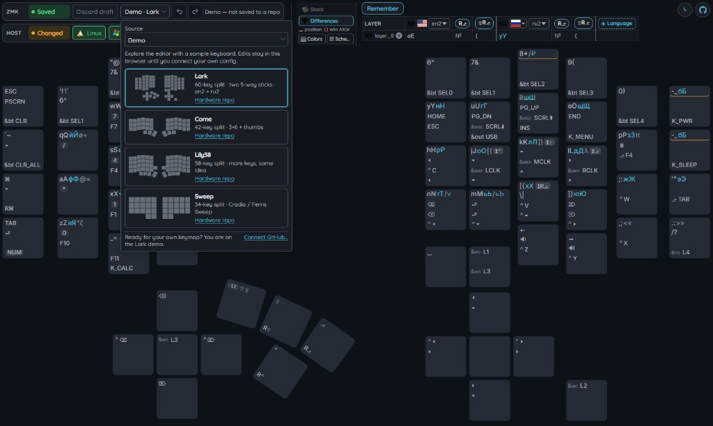
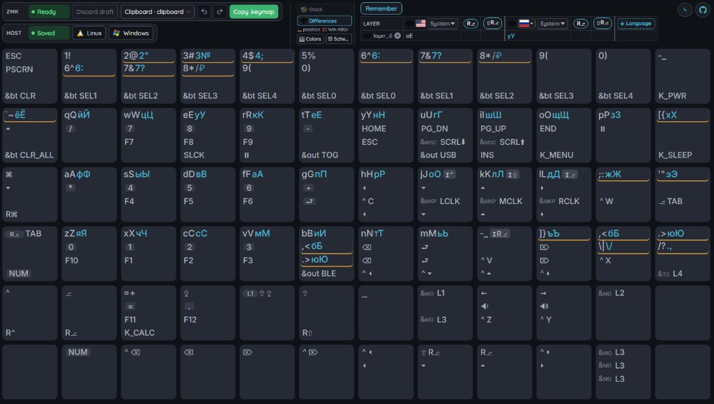
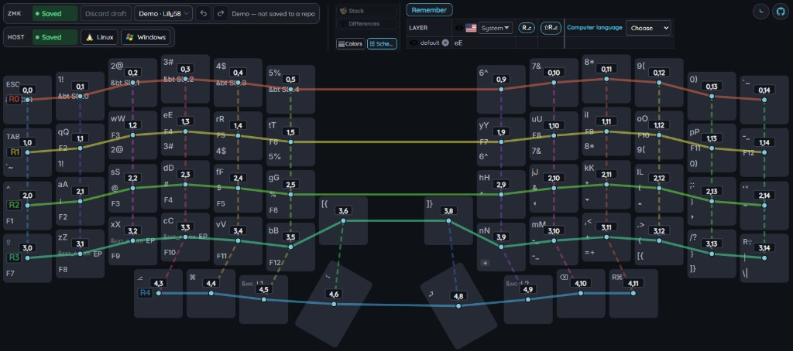
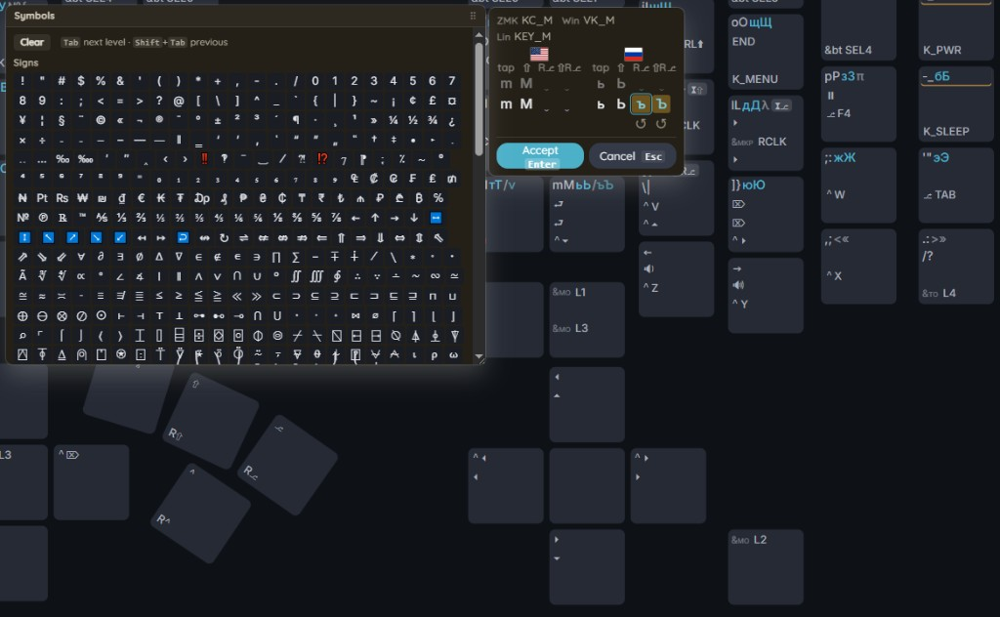
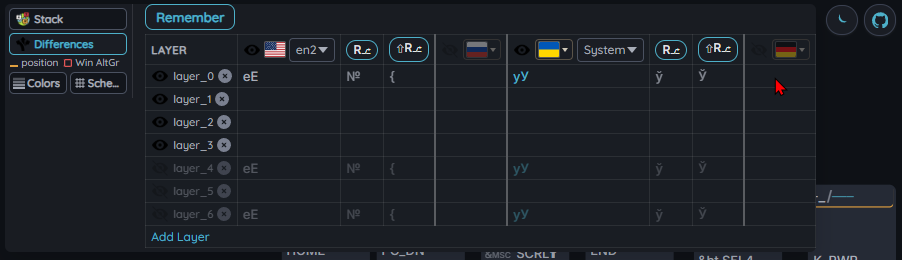

#  Keymap Editor

Browser editor for [ZMK](https://zmk.dev/) keymaps that shows what a key **actually types** on the host — not only the firmware binding line.

This fork ([katafoxi/keymap-editor-extended](https://github.com/katafoxi/keymap-editor-extended)) builds on [nickcoutsos/keymap-editor](https://github.com/nickcoutsos/keymap-editor). Hosted upstream: [keymap-editor](https://nickcoutsos.github.io/keymap-editor/). Upstream discussion: [Talk to me!](https://github.com/nickcoutsos/keymap-editor/discussions).

## What this fork adds

You combine:

1. **Firmware** — ZMK layers, hold-taps, behaviours (`&kp`, `&mt`, `&lt`, …)
2. **Host layouts** — OS language tables (EN, RU, UK, DE, …) with AltGr levels

so each keycap can show composed legends (e.g. `qQ` + `йЙ`) while you still edit the ZMK binding. Host glyphs are editable with **Alt+click** on a composed row; plain click opens the ZMK key editor.

Monorepo: Svelte 5 + Vite (`apps/web`), thin Hono API (`apps/api`), shared domain in `packages/keymap-core`.

## Screenshots

### Demo — real board layout

First visit opens **Demo** with bundled keyboards (Lark, Corne, Lily58, Sweep). Edits stay in the browser until you connect GitHub or use Clipboard / Local.



### Clipboard — `.keymap` only

Paste a ZMK `.keymap` without `info.json`: the app draws a **flat rectangular** board from the binding count so you can edit and **Copy .keymap** back into your repo. Add `info.json` when you want the real geometry.



### Scheme — matrix row/col

**Scheme** overlays matrix coordinates and row/column guides on the physical layout (useful when wiring or checking `info.json`).



### Host edit — Alt+click

Hover peeks at host levels; **Alt+click** locks an edit session (Accept / Cancel). System layouts fork to a user copy on first change; Linux (xkb) and Windows (`.klc`) install live in the Host lane.



### Several national layouts

Legend strip: show/hide languages, pick system or user profiles, stack or highlight symbol differences. Up to two languages on the keycap; more columns in the table.



## Keymap sources

| Source | Role |
|--------|------|
| **Demo** | Bundled fixtures for first visit. No firmware write. |
| **Clipboard** | Paste `.keymap` (`info.json` optional). **Copy .keymap** → system clipboard + preview dialog. |
| **GitHub** | Load/commit `zmk-config` via GitHub App + OAuth. **Latest** firmware artifact chip when available. |
| **Local** | Dev adapter to a sibling `zmk-config` (junction). Not the long-term product path. |

Product persistence is **GitHub-first**; Local is for iterating against a cloned firmware tree; Clipboard is browser-only paste/export. Save/load rules: [ADR 0001](docs/adr/0001-persistence-github-first.md), [ADR 0002](docs/adr/0002-keymap-file-contract.md).

## Editor highlights

- One **KeyEditor**: behaviour chips, then the value grid (keys, layers, mods, mouse/BT commands). Enter applies; Esc cancels.
- Compact ZMK legends (`L1`, `⌃`, hold-tap pills) in `keymap-core`.
- Undo / redo, **Draft** / Ready status, Discard draft.
- Host lane: Clean/Changed, Linux and Windows install dialogs, assemblies (remembered legend sets).
- Light / dark theme (default dark).

## Not in this tree (yet)

Upstream or planned: browser **File System Access**, visual **combo** / **macro** / custom **behavior** editors, rotary encoders, conditional layers, auto-generated layouts from ZMK DTS. See [upstream README](https://github.com/nickcoutsos/keymap-editor/blob/master/README.md) for the classic feature list.

Vision and contracts: [docs/TARGET_SYSTEM.md](docs/TARGET_SYSTEM.md).

## Run locally

```bash
pnpm install
pnpm dev
```

UI: `http://127.0.0.1:5173` · API: `http://127.0.0.1:8080`.

Full setup (env, Local junction, GitHub App): [running-locally.md](running-locally.md).

## Docs

| Doc | Content |
|-----|---------|
| [running-locally.md](running-locally.md) | Install, Demo, Clipboard, Local, GitHub, tests |
| [docs/TARGET_SYSTEM.md](docs/TARGET_SYSTEM.md) | Product vision |
| [docs/adr/](docs/adr/README.md) | Architecture decisions |
| [AGENTS.md](AGENTS.md) | Notes for coding agents |

## Tests

```bash
pnpm test          # Vitest: keymap-core, api, web
pnpm test:e2e      # Playwright smoke (separate)
```

## License

MIT. The ZMK keycode list is taken from the ZMK documentation, also MIT.
